# Explore Verrazzano and Consoles

## Introduction

You deployed the Helidon quickstart-mp application. In this lab, we will access the application and verify using multiple management tools.

### Grafana

Grafana is an open source solution for running data analytics, pulling up metrics that make sense of the massive amount of data & to monitor our apps with the help of nice customizable dashboards. The tool helps to study, analyse & monitor data over a period of time, technically called time series analytics.
Useful to track the user behaviour, application behaviour, frequency of errors popping up in production or a pre-prod environment, type of errors popping up and the contextual scenarios by providing relative data.

[https://grafana.com/grafana/](https://grafana.com/grafana/)

### Kibana

Kibana is a frontend application that sits on top of the Elastic Stack, providing search and data visualization capabilities for data indexed in Elasticsearch. Verrazzano uses Elasticsearch to store applications log entries.

[https://www.elastic.co/kibana/](https://www.elastic.co/kibana/)

### Prometheus

Prometheus is a monitoring and alerting toolkit. Prometheus collects and stores its metrics as time series data, i.e. metrics information is stored with the timestamp at which it was recorded, alongside optional key-value pairs called labels.

[https://prometheus.io/](https://prometheus.io/)

### Rancher

Rancher is a platform that enables Verrazzano to run containers on multiple Kubernetes clusters in production. It enables hybrid which means single pane of glass management of on-prem clusters and hosted on cloud services like.

[https://rancher.com/](https://rancher.com/)

### Objectives

In this lab, you will:

* Explore the Verrazzano console.
* Explore the Grafana console.
* Explore the Kibana console.
* Explore the Prometheus console.
* Explore the Rancher console.

### Prerequisites

* Running Kubernetes (OKE) Cluster on the Oracle Cloud Infrastructure.
* Verrazzano installed on a Kubernetes (OKE) cluster.
* Deployed Helidon quickstart-mp application.


## Task 1: Explore the Verrazzano Console

Verrazzano installs several consoles. The endpoints for an installation are stored in the `Status` field of the installed Verrazzano Custom Resource.

To get the endpoints for these consoles, copy the following command and paste it in the *Cloud Shell* and look at the `Status.Instance` field:

```bash
<copy>kubectl get vz -o yaml</copy>
```

```bash
$ kubectl get vz -o yaml
apiVersion: v1
items:
- apiVersion: install.verrazzano.io/v1alpha1
  kind: Verrazzano
  metadata:
    annotations:
      kubectl.kubernetes.io/last-applied-configuration: |
        {"apiVersion":"install.verrazzano.io/v1alpha1","kind":"Verrazzano","metadata":{"annotations":{},"name":"my-verrazzano","namespace":"default"},"spec":{"profile":"dev"}}
    creationTimestamp: "2021-08-23T15:19:23Z"
    finalizers:
    - install.verrazzano.io
    generation: 2
    managedFields:
    - apiVersion: install.verrazzano.io/v1alpha1
      fieldsType: FieldsV1
      fieldsV1:
        f:metadata:
          f:annotations:
            .: {}
            f:kubectl.kubernetes.io/last-applied-configuration: {}
        f:spec:
          .: {}
          f:profile: {}
      manager: kubectl
      operation: Update
      time: "2021-08-23T15:19:23Z"
    - apiVersion: install.verrazzano.io/v1alpha1
      fieldsType: FieldsV1
      fieldsV1:
        f:metadata:
          f:finalizers: {}
        f:spec:
          f:components:
            .: {}
            f:fluentd:
              .: {}
              f:extraVolumeMounts: {}
          f:security: {}
        f:status:
          .: {}
          f:conditions: {}
          f:instance:
            .: {}
            f:consoleUrl: {}
            f:elasticUrl: {}
            f:grafanaUrl: {}
            f:keyCloakUrl: {}
            f:kibanaUrl: {}
            f:prometheusUrl: {}
            f:rancherUrl: {}
          f:state: {}
          f:version: {}
      manager: verrazzano-platform-operator
      operation: Update
      time: "2021-08-23T15:30:06Z"
    name: my-verrazzano
    namespace: default
    resourceVersion: "49073970"
    selfLink: /apis/install.verrazzano.io/v1alpha1/namespaces/default/verrazzanos/my-verrazzano
    uid: c37cc781-1d16-4aa9-8e08-7111d786fe51
  spec:
    components:
      fluentd:
        extraVolumeMounts:
        - source: /u01/data/docker/containers/
    profile: dev
    security: {}
  status:
    conditions:
    - lastTransitionTime: "2021-08-23T15:19:24Z"
      message: Verrazzano install in progress
      status: "True"
      type: InstallStarted
    - lastTransitionTime: "2021-08-23T15:30:05Z"
      message: Verrazzano install completed successfully
      status: "True"
      type: InstallComplete
    instance:
      consoleUrl: https://verrazzano.default.XX.XX.XX.XX.nip.io
      elasticUrl: https://elasticsearch.vmi.system.default.XX.XX.XX.XX.nip.io
      grafanaUrl: https://grafana.vmi.system.default.XX.XX.XX.XX.nip.io
      keyCloakUrl: https://keycloak.default.XX.XX.XX.XX.nip.io
      kibanaUrl: https://kibana.vmi.system.default.XX.XX.XX.XX.nip.io
      prometheusUrl: https://prometheus.vmi.system.default.XX.XX.XX.XX.nip.io
      rancherUrl: https://rancher.default.XX.XX.XX.XX.nip.io
    state: Ready
    version: 1.0.0
kind: List
metadata:
  resourceVersion: ""
  selfLink: ""
```

Use the `https://verrazzano.default.YOUR_UNIQUE_IP.nip.io` to open the Verrazzano console.

Verrazzano *dev* profile use self signed certificate so you need to click *Advanced* to accept risk and skip warning.


Select *Proceed to verrazzano default XX.XX.XX.XX.nip.io(unsafe)*.


Because it redirects to the Keycloak console  URL for authentication, again on this page, click *Advanced*.


Select *Proceed to Keycloak default XX.XX.XX.XX.nip.io(unsafe)*.


Now we need the user name and password for the Verrazzano console. *Username* is *verrazzano* and to find out the password, go back to the *Cloud Shell* and paste the following command to find out the password for the *Verrazzano Console*.

```bash
<copy>kubectl get secret --namespace verrazzano-system verrazzano -o jsonpath={.data.password} | base64 --decode; echo</copy>
```

Copy the password and go back to the browser, where the *Verrazzano Console* is open. Paste the password in the *Password* field and enter *verrazzano* as *Username* and then click *Sign In*.


In the Home Page of the Verrazzano Console, you can see *System Telemetry* and because we installed the *Development Profile* of Verrazzano, you can see it in the *General Information* section. You can see the Helidon quickstart-mp application under *OAM Applications*. Select *hello-helidon-appconf* to view components of this application.

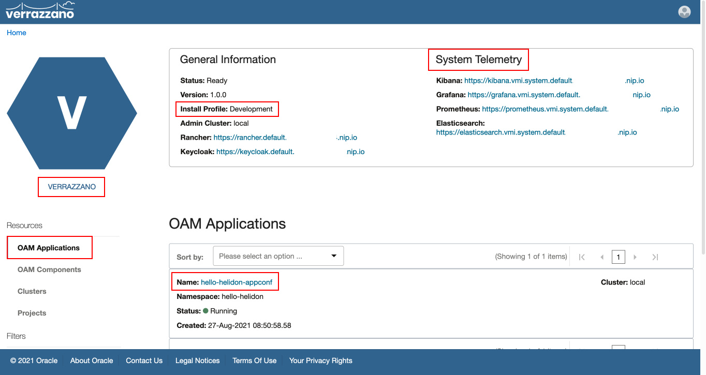

There is only one component for this application as you can see under *Components*. To explore the configuration click the **OAM Component Ref:** *hello-helidon-component* component as shown:


You can see *General Information* for this component. To learn about the *Workload Spec*, select *hello-helidon-component* as shown:

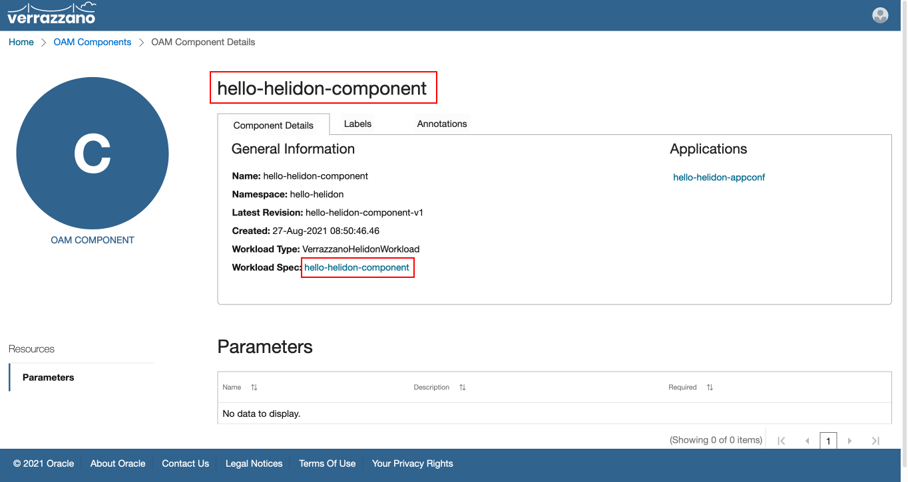

Here you can see the configuration details for the *hello-helidon-component* component. Click *Close*.

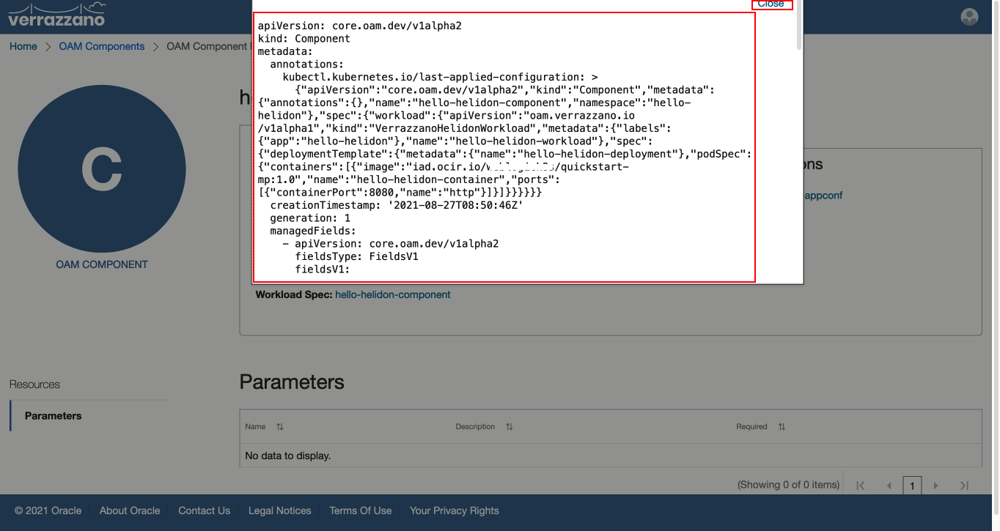

## Task 2: Explore the Grafana Console

Select *Home* to go back to Verrazzano Console Home Page.

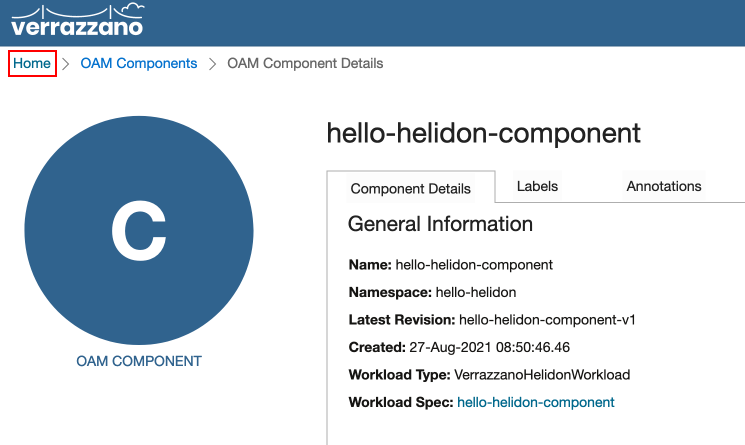

On the home page, you'll see the link for opening the *Grafana console*. Select the link for the *Grafana Console* as shown:


Click *Advanced*.


Select *grafana.vmi.system.default.XX.XX.XX.XX.nip.io(unsafe)*.


The Grafana Home Page opens. Select *Home*  at the top left.


Type *Helidon* and you will see *Helidon Monitoring Dashboard* under *General*. Click *Helidon Monitoring Dashboard*.

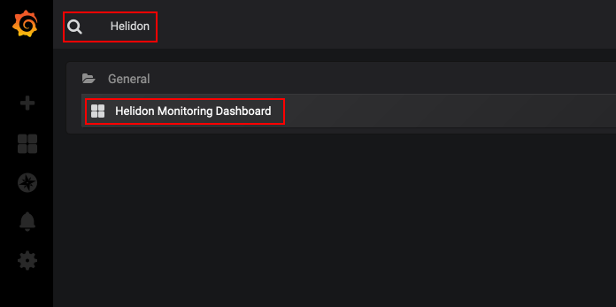

Here you can observe the JVM details of the Helidon quickstart-mp application. Like Status, Heap Usage, Running Time, JVM Heap, Thread Count, HTTP Requests, etc. This is a prebuilt dashboard specifically for Helidon workloads. Of course you can customize this dashboard according to your needs and add custom diagnostics information.

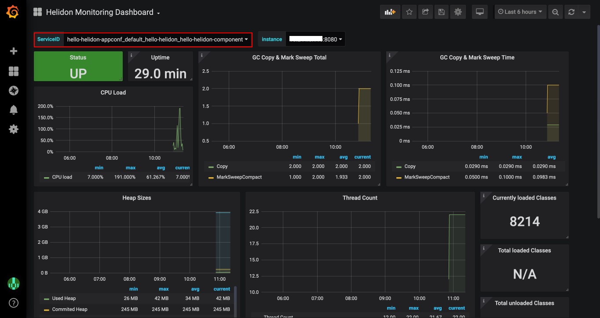

## Task 3: Explore the Kibana Console

Go back to the Verrazzano home page and select Kibana console.

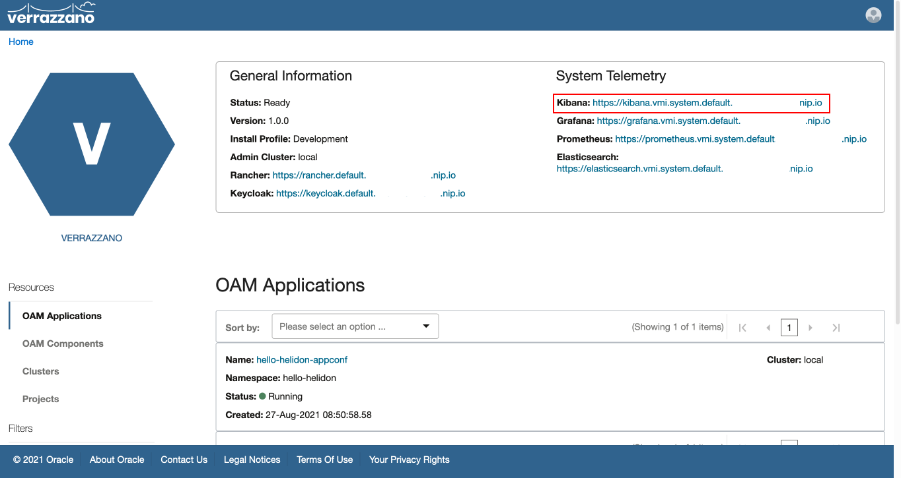

Select the *Proceed to ... default XX.XX.XX.XX.nip.io(unsafe)* if necessary.
On the Kibana homepage click the Discover link or its shortcut menu icon on the left side.

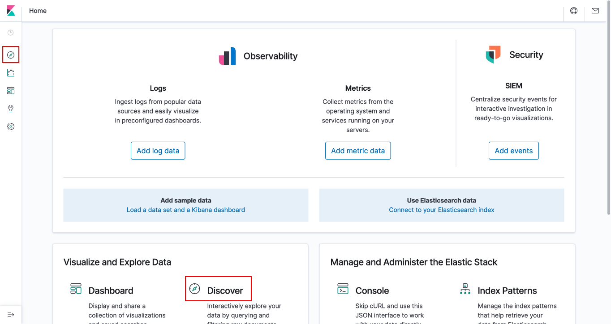

In order to find log entry in Elasticsearch first you need to define index pattern. Type *verrazzano-namespace-hello-helidon* in the **Index Pattern**. Select the the result from the list below and click **Next**.

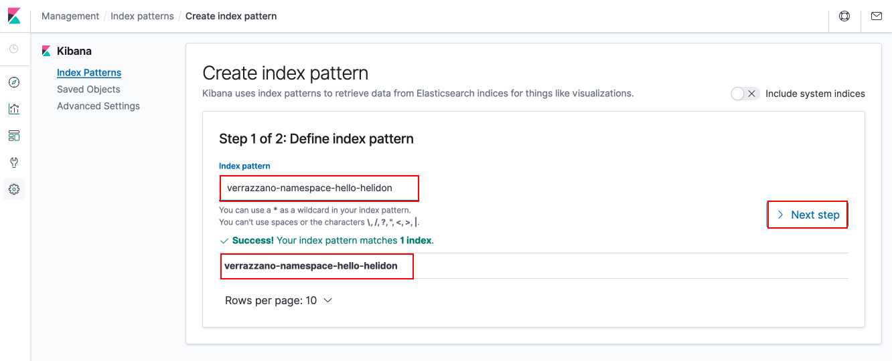

On the next page select *@timestamp* as **Time Filter field name** and click **Create Index pattern**.

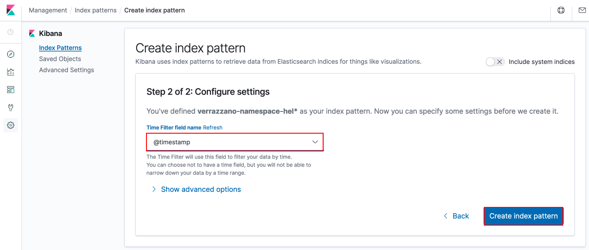

Type the custom log entry value you created in the Helidon application: *Help requested* into the filter textbox. Hit **Enter** or click **Refresh**. You should get at least one result. If you haven't hit the application endpoint or that happened long time ago simply invoke again the following HTTP request in Cloud Shell against your endpoint. You can execute multiple times.
```bash
<copy>curl -k https://$(kubectl get gateway hello-helidon-hello-helidon-appconf-gw -n hello-helidon -o jsonpath={.spec.servers[0].hosts[0]})/help/allGreetings; echo</copy>
```

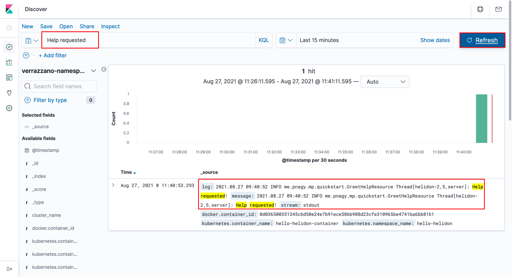

## Task 4: Explore the Prometheus Console

Go back to the Verrazzano home page and select Prometheus console.

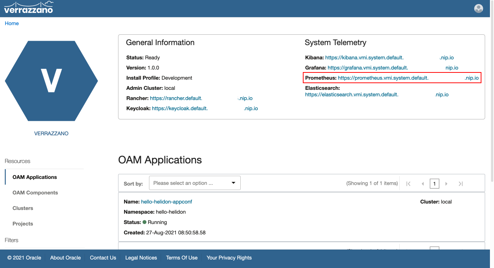

Select the *Proceed to ... default XX.XX.XX.XX.nip.io(unsafe)* if necessary.
On the Prometheus dashboard page type *help* into the search field and select your custom metric *application_me_pnagy_mp_quickstart_GreetHelpResource_helpCalled_total*.

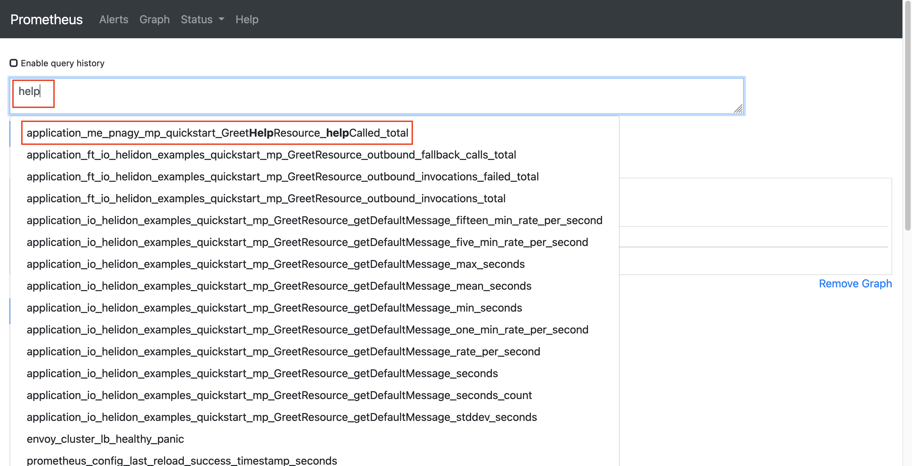

Click **Execute** and check the result below. You should see your metric's current value which means how many request was completed by your endpoint. You can also switch to *Graph* view instead of the *Console* mode.


You can also add another metric to your dashboard. Discover the available, default metrics in the list.

## Task 5: Explore the Rancher Console

Go back to the Verrazzano home page and select Rancher console.

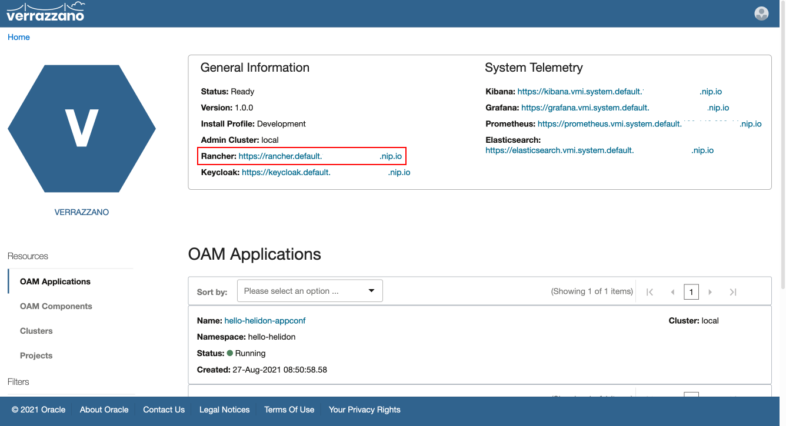

Select the *Proceed to ... default XX.XX.XX.XX.nip.io(unsafe)* if necessary.
Rancher requires separate credential. In Verrazzano `dev` profile the username is *admin*. To get the password execute the following command in Cloud Shell which extracts from the proper secret configuration:
```bash
<copy>kubectl get secret --namespace cattle-system rancher-admin-secret -o jsonpath={.data.password} | base64 --decode; echo</copy>
```
Using the values above login to the Rancher console.


TODO - could not login

## Acknowledgements

* **Author** -  Ankit Pandey
* **Contributors** - Maciej Gruszka, Peter Nagy
* **Last Updated By/Date** - Peter Nagy, August 2021
