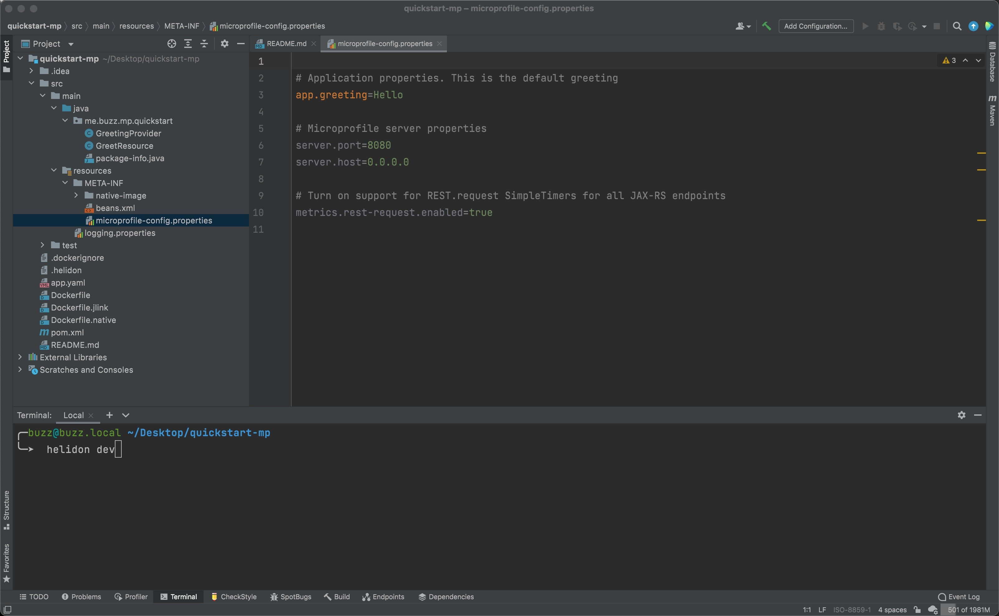
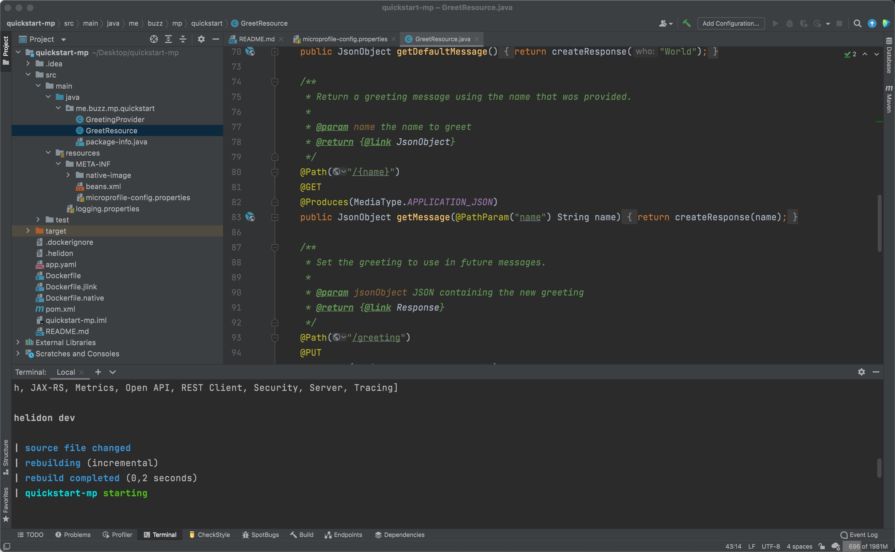
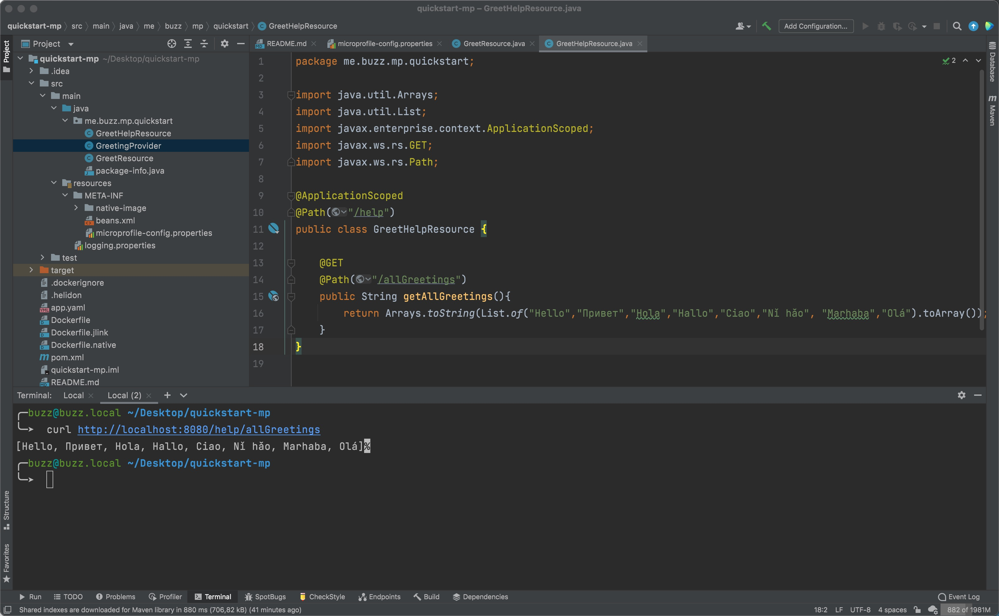

# Create Helidon Greeting Application

## Introduction

This lab walks you through the steps to create Helidon MP application and package using Docker.

### About Product/Technology

Helidon is designed to be simple to use, with tooling and examples to get you going quickly. Since Helidon is just a collection of libraries running on a fast Netty core, there is no extra overhead or bloat.

Helidon supports MicroProfile and provides familiar APIs like JAX-RS, CDI and JSON-P/B. Our MicroProfile implementation runs on our fast Helidon Reactive WebServer

Helidon Reactive WebServer provides a modern functional programming model and runs on top of Netty. Lightweight, flexible and reactive, the Helidon WebServer provides a simple to use and fast foundation for your microservices.

With support for health checks, metrics, tracing and fault tolerance, Helidon has what you need to write cloud ready applications that integrate with Prometheus, Jaeger/Zipkin and Kubernetes.

### Helidon CLI

The Helidon CLI lets you easily create a Helidon project by picking from a set of archetypes. It also supports a developer loop that performs continuous compilation and application restart, so you can easily iterate over source code changes.

The CLI is distributed as a standalone executable (compiled using GraalVM) for ease of installation. It is currently available as a download for Linux, Mac and Windows. Simply download the binary, install it at a location accessible from your PATH and you’re ready to go.

### Prerequisites

Helidon requires Java 11 (or newer) and Maven (3.6.1+).
You should make sure java and `mvn` are in your path.

## Task 1: Helidon CLI Installation
MacOS:
```bash
<copy>
curl -O https://helidon.io/cli/latest/darwin/helidon
chmod +x ./helidon
sudo mv ./helidon /usr/local/bin/
</copy>
```

Linux:
```bash
<copy>
curl -O https://helidon.io/cli/latest/linux/helidon
chmod +x ./helidon
sudo mv ./helidon /usr/local/bin/
</copy>
```

Windows:
```PowerShell
<copy>
PowerShell -Command Invoke-WebRequest -Uri "https://helidon.io/cli/latest/windows/helidon.exe" -OutFile "C:\Windows\system32\helidon.exe"
</copy>
```

For Windows you will also need the Visual C++ Redistributable Runtime. See [Helidon on Windows](https://helidon.io/docs/v2/#/about/04_windows) for more information.


## Task 2: Create Helidon Greeting App
In your console type:
```bash
<copy>helidon init</copy>
```

Then answer the questions.
For this demo we will create *MicroProfile* supported microservice, so, please, choose option **2** for Helidon Flavour:

```bash
Version 2.2.0 of this CLI is now available.
Please see https://github.com/oracle/helidon-build-tools/blob/master/helidon-cli/CHANGELOG.md to update.

Using Helidon version 2.3.2
Helidon flavor
  (1) SE
  (2) MP
Enter selection (Default: 1): 2
```

To have more functionality from the very beginning let us choose option **(2) quickstart**, then just press **Enter** for the default answers. This will be enough. Please note you can have different default package and project group name because it uses the os user name.

```bash
Select archetype
  (1) bare | Minimal Helidon MP project suitable to start from scratch
  (2) quickstart | Sample Helidon MP project that includes multiple REST operations
  (3) database | Helidon MP application that uses JPA with an in-memory H2 database
Enter selection (Default: 1): 2
Project name (Default: quickstart-mp):
Project groupId (Default: me.buzz-helidon):
Project artifactId (Default: quickstart-mp):
Project version (Default: 1.0-SNAPSHOT):
Java package name (Default: me.buzz.mp.quickstart):
Switch directory to /Users/mitia/Desktop/quickstart-mp to use CLI

Start development loop? (Default: n):
```

For the **development loop** we will come a bit later.

Wonderful! Now we have a fully functional Microservice Maven Project:

```bash
quickstart-mp
├── Dockerfile
├── Dockerfile.jlink
├── Dockerfile.native
├── README.md
├── app.yaml
├── pom.xml
└── src
    ├── main
    │   ├── java
    │   │   └── me
    │   │       └── buzz
    │   │           └── mp
    │   │               └── quickstart
    │   │                   ├── GreetResource.java
    │   │                   ├── GreetingProvider.java
    │   │                   └── package-info.java
    │   └── resources
    │       ├── META-INF
    │       │   ├── beans.xml
    │       │   ├── microprofile-config.properties
    │       │   └── native-image
    │       │       └── reflect-config.json
    │       └── logging.properties
    └── test
        └── java
            └── me
                └── buzz
                    └── mp
                        └── quickstart
                            └── MainTest.java

```

## Task 3: Run locally the Helidon Greeting App
In the same console/terminal. from the quickstart-mp directory run the following two commands.

With JDK11+
```bash
<copy>
mvn package
java -jar target/quickstart-mp.jar
</copy>
```

### Exercise the application

Open a new terminal/console and run the following commands to check the application.

```bash
curl -X GET http://localhost:8080/greet
{"message":"Hello World!"}

curl -X GET http://localhost:8080/greet/Joe
{"message":"Hello Joe!"}

curl -X PUT -H "Content-Type: application/json" -d '{"greeting" : "Hola"}' http://localhost:8080/greet/greeting

curl -X GET http://localhost:8080/greet/Jose
{"message":"Hola Jose!"}
```

### Try health and metrics

In the same terminal/console, run the following commands to check health and metrics.

```bash
curl -s -X GET http://localhost:8080/health
{"outcome":"UP",...
. . .

# Prometheus Format
curl -s -X GET http://localhost:8080/metrics
# TYPE base:gc_g1_young_generation_count gauge
. . .

# JSON Format
curl -H 'Accept: application/json' -X GET http://localhost:8080/metrics
{"base":...
. . .

```

Press 'Ctrl + C' in the terminal, where you have running the "java -jar target/quickstart-mp.jar" commands to stop the *quickstart-mp* application.

## Task 4: Modify the app

Ok, let us modify our application. Let us open our favourite IDE and find **microprofile-config.properties** file.



In the console/terminal, in the folder of the project, type:

```bash
<copy>helidon dev</copy>
```

This will start the **Development loop** we've mentioned earlier.

Now change the property *app.greeting* to "Hello Oracle" for example.

```properties
<copy>app.greeting=Hello Oracle</copy>
```


You will see that whenever we change any file, the **Helidon CLI** recognizes there is a change, recompiles the app, and reruns it. Since Helidon is really small, everything happens really quickly.

Now if you type in your console:

```bash
<copy>curl -X GET http://localhost:8080/greet</copy>
```

The result is expected to be:

```json
{"message":"Hello Oracle World!"}
```

We have made our first modification!.

Let us now jump to some Java code. Please, open the **GreetResource.java** file.

As you may see it is a pure MicroProfile compatible code:



Let us now create a new functionality.
Let us create a new end point, that provides help for different greeting in different languages.

Just create a new class **GreetHelpResource** with the following code:

```java
<copy>
import java.util.Arrays;
import java.util.List;
import java.util.logging.Logger;

import javax.enterprise.context.ApplicationScoped;
import javax.ws.rs.GET;
import javax.ws.rs.Path;

import org.eclipse.microprofile.metrics.annotation.Counted;

@ApplicationScoped
@Path("/help")
public class GreetHelpResource {

	Logger LOGGER = Logger.getLogger(GreetHelpResource.class.getName());

    @GET
    @Path("/allGreetings")
    @Counted(name = "helpCalled", description = "How many time help was called")
    public String getAllGreetings(){
    	LOGGER.info("Help requested!");
        return Arrays.toString(List.of("Hello","Привет","Hola","Hallo","Ciao","Nǐ hǎo", "Marhaba","Olá").toArray());
    }
}
</copy>
```

The class has only one method *getAllGreetings* which returns a list with greetings in different languages. While copying the code, if you encounter an error, then add the necessary package name.

Now as we build and run the application:

```bash
<copy>
mvn package
java -jar target/quickstart-mp.jar
</copy>
```

And as we do curl:

```bash
<copy>curl http://localhost:8080/help/allGreetings</copy>
```
The expected result:
```bash
[Hello, Привет, Hola, Hallo, Ciao, Nǐ hǎo, Marhaba, Olá]
```

If we take a look at the metrics:

```bash
curl http://localhost:8080/metrics

...
# TYPE application_me_buzz_mp_quickstart_GreetHelpResource_helpCalled_total counter
# HELP application_me_buzz_mp_quickstart_GreetHelpResource_helpCalled_total How many time help was called
application_me_buzz_mp_quickstart_GreetHelpResource_helpCalled_total 3
...
```

We'll see a new counter appeared. Whenever this Endpoint is called the value above will increment.

We will also see in the console an INFO log line about this call:

```bash
INFO me.buzz.mp.quickstart.GreetHelpResource Thread[helidon-4,5,server]: Help requested!
```

This easy we can add a new endpoint!



So, working with Helidon and its tooling is really easy and fast!

Please leave your terminal/console open and continue with Verrazzano installation lab.

## Acknowledgements

* **Author** -  Dmitry Aleksandrov
* **Contributors** - Maciej Gruszka, Peter Nagy
* **Last Updated By/Date** - Peter Nagy, August 2021
