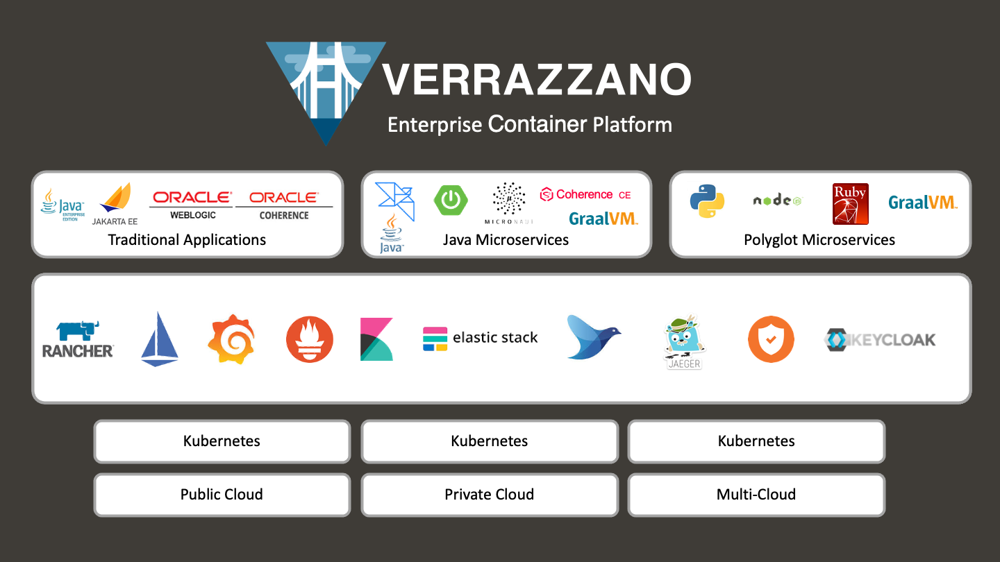

# Introduction

## About this Workshop

This lab offers attendees an intro-level, hands-on session with Helidon and Verrazzano, from the first step to making services, to assembling, and finally deploy on an enterprise container platform.

This workshop is a BYOL (Bring Your Own Laptop) session, so bring your Windows, OSX, or Linux laptop. You need JDK 11+ on your machine, Apache Maven (3.6+), and Docker.

You will first install Helidon CLI tools and develop the HTTP microservice application. For Verrazzano you will setup Oracle Kubernetes Engine (OKE) on Oracle Cloud Infrastructure using Oracle Cloud Free Tier account which is sufficient to explore and learn how to run and operate microservice application on enterprise level.

The idea is that you leave this workshop with a good understanding of what Helidon and Verrazzano are, and how it can help you in your projects. Then, you still can use your Oracle Free Tier cloud account to learn all the capabilities of these projects and Oracle Cloud Infrastructure.

This workshop should be as self explanatory as possible. So your job is to follow the instructions by yourself, and do not hesitate to ask for any clarification or assistance.

>Please note the provisioning of Oracle Kubernetes Engine and installation of Verrazzano requires certain amount of time. To save time you will be asked to do development and environment setup paralel. Please follow the instructions and switch between tasks when it is required and necessary.

## About Product/Technology

### Helidon
Helidon is a open source microservices framework introduced by Oracle. Helidon is a collection of Java libraries designed for creating lightweight and fast microservices-based applications. The framework supports two programming models for writing microservices: Helidon SE and Helidon MP.
While Helidon SE is designed to be a microframework that supports the reactive programming model, Helidon is an implementation of the MicroProfile specification. Since MicroProfile has its roots in Java EE, the MicroProfile APIs follow a familiar, declarative approach with heavy use of annotations. This makes it a good choice for Java EE developers.
The MicroProfile features aim at the implementation of microservices. You can find APIs for defining REST Clients, monitoring the application, reading technical and functional statistics and for configuring the application.
Helidon has also  added additional APIs to the core set of Microprofile APIs giving you all the capabilities you need for writing modern cloud native applications.

> The [MicroProfile](https://microprofile.io/) standard builds on Jakarta EE. Like Jakarta EE MicroProfile is open source as well and is developed by the Eclipse Foundation. As with Jakarta EE, implementation with MicroProfile takes place in the libraries or application servers implementing the standard.

### Verrazzano
Verrazzano is an end-to-end enterprise container platform for deploying cloud-native and traditional applications in multicloud and hybrid environments. It is made up of a curated set of open source components – many that you may already use and trust, and some that were written specifically to pull together all of the pieces that make Verrazzano a cohesive and easy to use platform.

Verrazzano includes the following capabilities:
- Hybrid and multicluster workload management
- Special handling for WebLogic, Coherence, and Helidon applications
- Multicluster infrastructure management
- Integrated and pre-wired application monitoring
- Integrated security
- DevOps and GitOps enablement

### Objectives

1. Set up an Oracle Kubernetes Engine instance on the Oracle Cloud Infrastructure.
2. Install Verrazzano platform.
3. Deploy the *Helidon MP* application.
4. Monitor the *Helidon MP* application using Verrazzano tools, including Kibana, Grafana and Prometheus.

## Learn More

* [https://helidon.io](https://helidon.io)
* [https://verrazzano.io/](https://verrazzano.io/)

## Acknowledgements

* **Author** -  Peter Nagy
* **Contributors** - Maciej Gruszka, Peter Nagy
* **Last Updated By/Date** - Peter Nagy, August 2021
